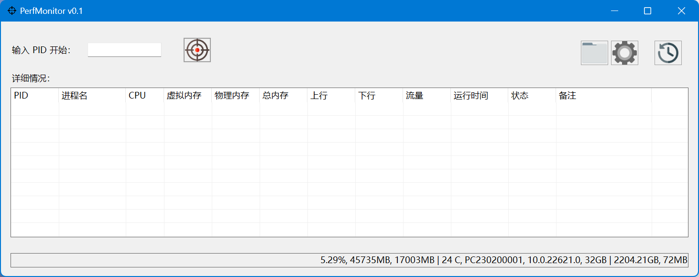
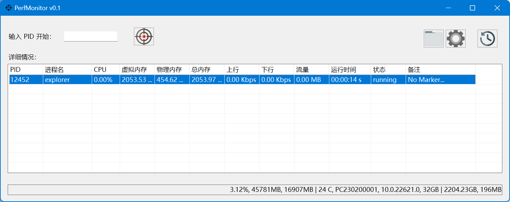
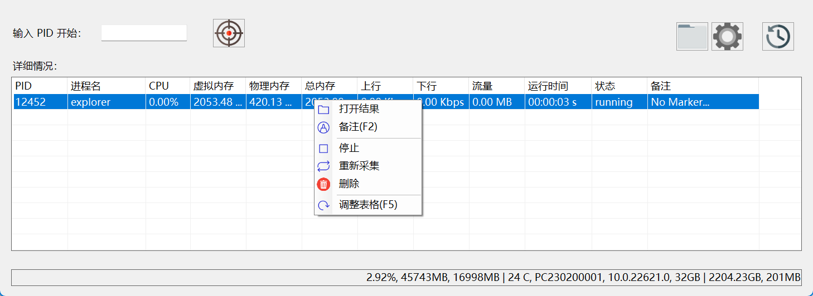
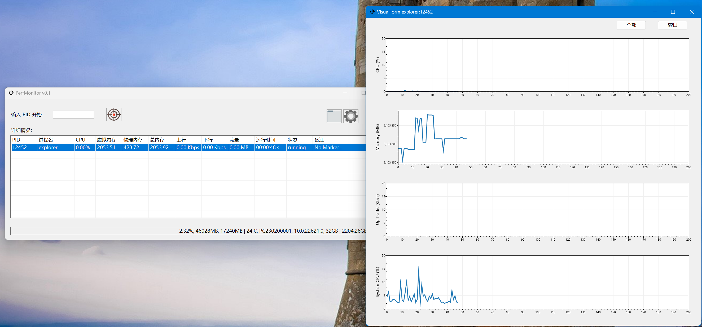

# Performance Monitor On Windows

为长时间性能监测用，输出 csv 文件，程序 CPU 使用率和（任务管理器 - 详细信息）一致，系统 CPU 和（任务管理器 - 性能）一致

## Platform
- Win7（未测试）
- Win10
- Win11

## Usage
主界面
执行
菜单
可视化
历史

## Install 

如果没有安装 dotnet desktop runtime 可能出现以下错误，点击 是(Y) 下载之后安装即可

## 
基于 dotnet 6 desktop
